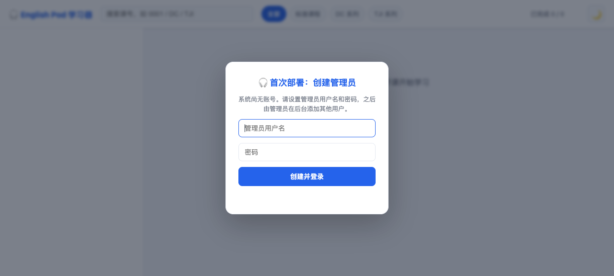
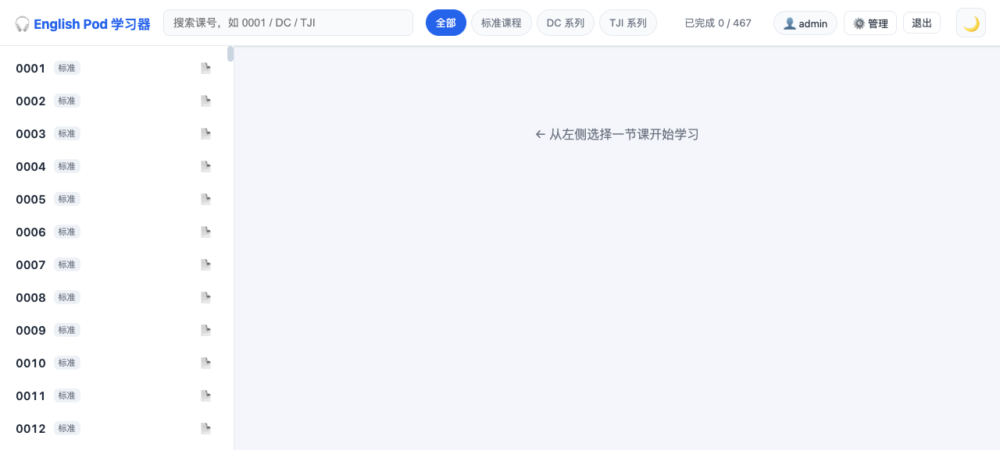
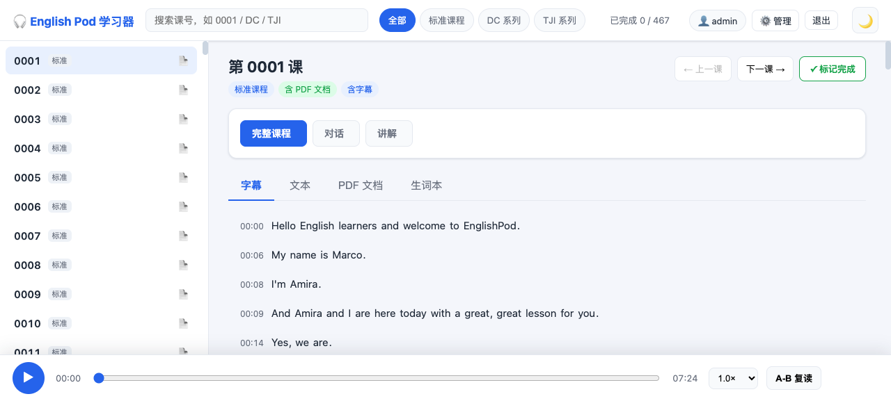
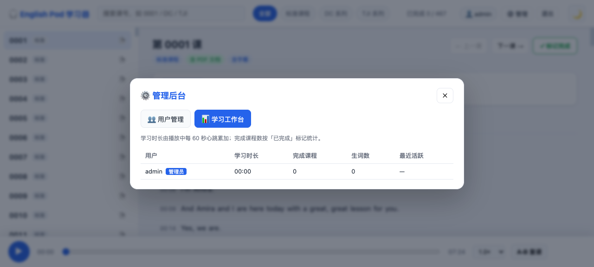

# English Pod 学习器

纯本地网页应用：后端 Python 标准库 + 前端原生 JS，通过 Docker Compose 部署。
音频/字幕/词典等**全部离线资源存放在宿主机文件夹中**，compose 文件里写明路径挂载进容器读取，**不打进镜像**——换机器、升级代码都无需重新上传资料。

**多用户**：账号、学习进度、生词本、学习时长均存储在服务器 SQLite（`data/appdata/app.db`），每人独立；首次部署需在引导界面创建管理员，新用户只能由管理员在后台添加（不支持注册）。

---

## 一、部署要求（Requirements）

| 项目 | 要求 |
|---|---|
| 系统 | 飞牛 FnOS（或其他支持 Docker 的 Linux / NAS） |
| Docker | Docker Engine 20.10+，含 `docker compose` 插件（飞牛「Docker 套件」自带） |
| 端口 | 8787 未被占用（可改 compose 中 `ports`） |
| 磁盘 | 课程资料约 5.2G（音频）+ 词典约 66M（另需约 120M 空间生成索引） |
| 网络 | 首次 `docker compose up` 需联网拉取 `python:3.13-slim` 基础镜像 |
| 浏览器 | 任意现代浏览器（Chrome / Edge / Safari），建议 PC/平板，支持音频播放与拖进度 |

> 也可以完全不用 Docker：只要机器装了 Python 3.7+ 就能直接跑源码，见「四、免 Docker 直接运行」。

## 二、目录结构（数据都在 `data/` 文件夹里）

```
englishpod/
├── data/
│   ├── audio/                ← 课程音频（约 5.2G，1197 个 mp3，原 englishpod_all）
│   ├── srt/  txt/  pdf/      ← 字幕 / 文本 / 讲义 PDF（按课号对应音频）
│   ├── dict/                 ← 离线英汉词典 ECDICT：ecdict.csv（66M）+ ecdict.db（索引，可删）
│   └── appdata/              ← 多用户数据（账号/进度/生词本/学习时长）app.db，容器首次启动自动生成
├── server.py                 ← 应用代码（Python 标准库，零依赖，Docker 与本地共用）
├── webapp/                   ← 前端页面
├── docker/                   ← Docker 部署专属：Dockerfile + docker-compose.yml（在 docker/ 目录内执行 compose）
├── local/                    ← 本地直接运行专属：start.sh（终端）/ start.command（macOS 双击）
├── test/check.sh             ← 部署自检脚本：上传飞牛前后跑一次确认资源齐备（bash test/check.sh）
├── screenshots/              ← 界面预览图（README 引用，含 4 张：首次部署/课程列表/播放器/管理后台）
├── config.json               ← 在线词典 API key / 代理配置（含密钥，勿提交 git）
├── template/                 ← 配置模板：config.example.json（字段与 config.json 一致，复制改名后填 key 即可用）
├── .dockerignore             ← 仅 Docker 构建用（必须位于构建上下文根目录，即项目根）
└── README.md
```

> **课程资料需自行下载后放入对应文件夹**（仓库 `.gitignore` 已排除 `data/` 内部数据，仅保留目录骨架占位 `.gitkeep`）：
>
> | 类型 | 来源仓库 | 放入目录 |
> |---|---|---|
> | **PDF 讲义** / **SRT 字幕** / **TXT 文本** | [github.com/guaguaguaxia/english_pod](https://github.com/guaguaguaxia/english_pod) | `data/pdf/` `data/srt/` `data/txt/` |
> | **MP3 音频**（约 5.2G，1,197 个文件） | [archive.org/details/englishpod_all](https://archive.org/details/englishpod_all) | `data/audio/` |
>
> 两份原始资料均**只含公开学习材料**。离线英汉词典（`data/dict/ecdict.csv`）需单独下载，见「八、配置文件 → 离线英汉词典」一节。

### 每种运行方式需要哪些文件

| 文件/目录 | Docker 部署 | 本地直接运行 |
|---|---|---|
| `server.py` | ✅ 必须（构建进镜像） | ✅ 必须 |
| `webapp/` | ✅ 必须（构建进镜像） | ✅ 必须 |
| `data/audio` | ✅ 必须（卷挂载，无音频则无课可学） | ✅ 必须 |
| `data/srt` `txt` `pdf` | ⚪ 可选（缺则对应功能自动隐藏） | ⚪ 可选 |
| `data/dict`（ecdict.csv） | ✅ 建议（缺则离线词典不可用，其余正常） | ✅ 建议 |
| `data/appdata` | ✅ 自动生成（多用户数据） | ✅ 自动生成 |
| `config.json` | ⚪ 可选（在线词典 key，缺则在线查词不可用） | ⚪ 可选 |
| `docker/` | ✅ 必须（compose + Dockerfile） | ❌ 不需要 |
| `local/` | ❌ 不需要 | ✅ 便捷启动器（也可直接 `python3 server.py --data ./data`） |
| `.dockerignore` | ✅ 建议（防止把 data/ 打进构建上下文） | ❌ 不需要 |
| `test/` | ⚪ 可选（部署前自检） | ⚪ 可选 |

> 两种方式共用同一份 `server.py` / `webapp/` / `data/`；区分点只在启动层：Docker 用 `docker/` 下的构建与编排文件，本地用 `local/` 下的启动脚本（或直接命令行）。

## 三、界面预览

| 首次部署引导 | 课程列表 |
|---|---|
|  |  |
| 播放器（音频 + 字幕） | 管理后台·学习工作台 |
|  |  |

## 四、飞牛部署步骤（数据放宿主机文件夹，compose 写路径读取）

### 1. 在飞牛建立文件夹并上传

在飞牛「文件」应用中建共享目录（如 `/vol1/1000/docker/englishpod/`），把整个项目目录（含 `data/`）上传进去。

> 飞牛共享文件夹绝对路径形如 `/vol1/1000/<共享名>/...`；右键文件夹 → 属性可查看真实路径。
> 上传前可先跑 `bash test/check.sh` 自检离线资源是否齐备。

### 2. compose 中写数据路径（两种方式任选）

**方式 A（默认，无需改任何路径）**——数据就在项目目录 `data/` 下，compose 用相对路径直接挂载（路径基于 `docker/` 目录，`../data` 即项目根的 `data/`）：

```yaml
    volumes:
      - ../data/audio:/data/audio:ro   # 课程音频（只读）
      - ../data/srt:/data/srt:ro       # 字幕（只读）
      - ../data/txt:/data/txt:ro       # 文本（只读）
      - ../data/pdf:/data/pdf:ro       # 讲义 PDF（只读）
      - ../data/dict:/data/dict                                   # 离线词典（可写，需生成索引）
      - ../data/appdata:/data/appdata                             # 多用户数据（可写，持久化账号/进度）
      - ../config.json:/app/config.json:ro                        # API key / 代理
```

**方式 B（数据与代码分离，推荐长期使用）**——在飞牛单独建共享文件夹放课程和词典，把左侧换成绝对路径：

```yaml
    volumes:
      - /vol1/1000/media/EnglishPod音频:/data/audio:ro
      - /vol1/1000/media/EnglishPod字幕:/data/srt:ro
      - /vol1/1000/media/EnglishPod文本:/data/txt:ro
      - /vol1/1000/media/EnglishPod讲义:/data/pdf:ro
      - /vol1/1000/dict/ECDICT:/data/dict
      - /vol1/1000/docker/englishpod/appdata:/data/appdata
      - ./config.json:/app/config.json:ro
```

> - 课程资料按子目录挂到容器 `/data` 下的 `audio/` `srt/` `txt/` `pdf/`（容器内由 `EP_DATA_DIR` 指定为 `/data`，可自行修改）；音频缺一不可，srt/txt/pdf 缺失时对应功能自动隐藏。
> - 词典目录**必须**含 `ecdict.csv`；挂载点建议保持 `/data/dict`（可改，但词典目录需**可写**以便首启生成 `ecdict.db` 索引）。
> - 若坚持把词典挂成只读 `:ro`，代码会自动把索引构建到容器内可写缓存目录（容器重建后需重新构建一次，约 1 分钟）。
> - 多用户数据目录**必须可写**，否则无法创建账号（可通过 `EP_APP_DB` 环境变量改到其他可写路径）。

### 3. 构建并启动

在飞牛「Docker 套件」导入 `docker/docker-compose.yml`（或 ssh 进飞牛进入 `docker/` 目录）：

```bash
cd docker
docker compose up -d --build
```

> 不进入 `docker/` 目录也可：`docker compose -f docker/docker-compose.yml up -d --build`。

首次会拉取基础镜像并构建，需联网；完成后访问 **http://飞牛IP:8787/**。

### 4. 日常管理

```bash
cd docker
docker compose ps            # 状态
docker compose logs -f       # 日志
docker compose restart       # 改完 config.json 后重启生效
docker compose up -d --build # 更新代码后重建
docker compose down          # 停止
```

`restart: unless-stopped` 已配置，飞牛重启后自动拉起。

## 五、免 Docker 直接运行（本地 / 任意 Linux / macOS）

只要机器装了 Python 3.7+，不用 Docker 也能跑：

```bash
cd /path/to/englishpod
python3 server.py --data ./data --host 0.0.0.0 --port 8787
```

- 不传 `--data` 时默认就是项目目录下的 `data/`（内含 audio/srt/txt/pdf/dict）。
- `--host 0.0.0.0` 让同一局域网的其他设备也能访问（NAS 场景必需）。
- 用 `nohup ... &` 或 systemd / 飞牛「计划任务」让它后台常驻。
- macOS 用户可直接**双击 `local/start.command`** 一键启动并自动打开浏览器（Linux/macOS 也可用 `bash local/start.sh`）。

## 六、多用户：首次部署、登录与后台管理

- **首次部署**：第一次打开 http://飞牛IP:8787/ 会显示「创建管理员」引导界面，设置管理员用户名与密码后自动登录。
- **登录**：之后每次打开页面要求登录；账号由管理员分配，**不支持自助注册**。
- **管理员后台**：登录后点右上角「⚙️ 管理」进入：
  - **👥 用户管理**：添加新用户（填用户名+初始密码）、停用/启用、重置密码、删除（删除会一并清除该用户进度与生词本）。
  - **📊 学习工作台**：查看每个用户的学习时长（播放中每 60 秒心跳累加）、完成课程数、生词数与最近活跃时间。
- **数据隔离**：学习进度（完成标记/播放位置）与生词本按用户独立存储在服务端 `data/appdata/app.db`；不同用户互不可见。词典缓存与界面主题仍存浏览器本地。
- **忘记管理员密码**：① 删除 `data/appdata/app.db` 后重启容器回到「首次部署」界面重新创建管理员（**会清空全部用户与学习数据**，慎用）；② 或 ssh 进容器执行重置（只改密码，不动数据）：
  ```bash
  docker exec -it englishpod-web python3 -c "
  import sys; sys.path.insert(0,'/app'); import server
  from server import reset_password, list_users
  print(list_users())
  reset_password(<管理员id>, '新密码')"
  ```
- **旧版（无多用户）数据自动迁移**：首次登录时若服务端还没有该用户的进度，会自动把浏览器 localStorage 里的旧进度/生词一次性迁移上传，不丢失。

## 七、课程分类：只按课号，不按难度

课程不区分难度等级，左侧课单直接按课号（标准课程 0001~0365，另有 DC / TJI 系列）排列与筛选，搜索框输入课号即可快速定位。若你确实需要难度标签，可自行维护数据（不内置，避免误导）。

## 八、配置文件 config.json（词典与代理）

```json
{
  "mw_learners_key": "你的 Learner's 词典 key",
  "mw_dict_key": "你的 Collegiate 词典 key",
  "proxy": ""
}
```

### 在线词典（Merriam-Webster）

查词弹窗内有三个独立标签页：**学习词典（Learner's）/ 大学词典（Collegiate）**（Merriam-Webster 在线，经后端代理，密钥不暴露前端）+ **英汉词典（ECDICT 离线）**，各自独立查询与缓存。

- 密钥优先级：**环境变量 > config.json > 空**。
- 申请地址：dictionaryapi.com；不配置时对应标签页提示「词典未配置」，不影响离线英汉词典。
- Docker 部署：直接改宿主机 `config.json` 后，在 `docker/` 目录执行 `docker compose restart` 即可，无需重建镜像；也可用环境变量注入：
  ```yaml
  environment:
    - MW_LEARNERS_KEY=xxx
    - MW_DICT_KEY=xxx
    - MW_PROXY=http://127.0.0.1:7890
  ```

### 离线英汉词典（ECDICT）

无需联网、无需 key，查词即时返回，含中文释义 / 英文释义 / 词性 / 柯林斯星级 / 牛津3000 / BNC·COCA 词频 / 词形变化。

- 词库文件位于 `data/dict/ecdict.csv`（约 66MB，77 万词条），下载自 [github.com/skywind3000/ECDICT](https://github.com/skywind3000/ECDICT)（仓库根目录 `ecdict.csv`）。国内网络可用镜像加速，例如：
  ```bash
  curl -L -o data/dict/ecdict.csv "https://gh-proxy.com/https://raw.githubusercontent.com/skywind3000/ECDICT/master/ecdict.csv"
  ```
- 首次查询时服务端自动构建 SQLite 索引（`data/dict/ecdict.db`，约数秒），之后秒查；索引可删，首启自动重建。
- Docker 部署下 `data/dict` 挂为可写卷，词典随离线资源走，升级镜像不用重新上传；若挂成只读，索引会落到容器内可写缓存目录（容器重建后需重新构建一次）。

### 代理服务器

若访问 dictionaryapi.com 需要走代理（如机场/内网），在 `config.json` 的 `proxy` 填 `http://127.0.0.1:7890` 这类地址（或环境变量 `MW_PROXY`），留空直连。改完重启服务生效。

> `config.json` 含密钥，请勿提交到 git（已加入 `.gitignore`）。

## 九、迁移到新机器

1. 复制整个项目目录 `englishpod/`（含 `data/` 全部离线资源）到新机器。
2. 无需改任何路径：离线资源、配置都随目录走，`cd docker && docker compose up -d --build` 即可（或 `python3 server.py --data ./data`）。
3. 若只想迁移代码不带词典：可删除 `data/dict/ecdict.db`（构建产物），保留 `ecdict.csv` 即可，服务首启自动重建索引。
4. 用户与学习数据都在 `data/appdata/app.db` 里一并迁移。

## 十、常见问题

- **ecdict.db 可以删吗？** 可以。它是 `ecdict.csv` 生成的 SQLite 索引（约 113M），删掉后服务首启自动重建（约 1 分钟）；也可提前在本地跑一次服务生成再随包上传，减少飞牛首次等待。
- **课程文件能只读吗？** 课程目录挂载为 `:ro` 只读，应用仅流式读取、绝不改动资料。
- **学习进度会丢吗？** 不会。进度与生词本存在服务端（`data/appdata/app.db`），换浏览器、换设备登录同一账号都能看到；只有界面主题与词典缓存是浏览器本地的。
- **升级旧版（无多用户）会丢进度吗？** 不会。旧版数据在浏览器 localStorage，首次登录时若服务端还没有该用户的进度，会自动把本机 localStorage 的旧进度/生词一次性迁移上传。
- **docker compose 报构建上下文太大？** 已配置 `.dockerignore` 排除 `data/`，构建上下文仅约 0.1M，不会把 5.2G 资料打进镜像。
